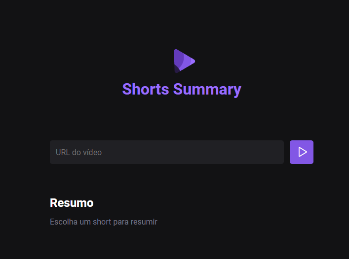

## Shorts Summary 👨‍💻

I developed this tool at RockeatSeat's Artificial Intelligence NLW, for three days they taught front-end, back-end and AI principles, developing this tool that summarizes Youtube Shorts.

✅ Acess the project here:

> linkaindanaodisponivel

## 📚 New Learnings

- Better file separation, modularization, import...
- Another front-end experience with CSS, HTML and JS
- I expanded my knowledge of JavaScript, NodeJS and NPM, as I haven't used them many times, but I'm contextualizing myself in these areas.
- Use of FFMPEG and PIPELINE from XENOVA/TRANSFORMES, which are artificial intelligences to transcribe audio texts and summarize.
- Integration of Front with Back, requests, GET, POST method...

## 👨🏼‍🎓 My certificate

Acess my certificate of participation and conclusion here:

> https://app.rocketseat.com.br/certificates/189ebd4e-63aa-4c79-8093-30584a646a8c
